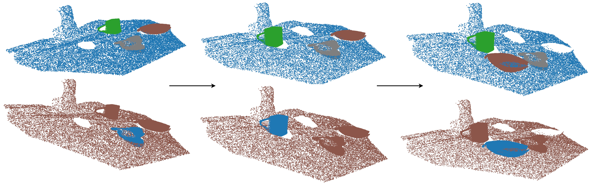

# Video to Transforms

### Example Video and Prompt Input:

Video:


<!--  -->

Prompt:
```python
object_names = "rubber duck. blue box. wooden bowl"
```

### Example Output Data:


<!--  -->

## Installation

You will need CUDA 12.1 to run this method.

1. Clone the repository with submodules:

```bash
git clone --recurse-submodules https://github.com/kallol-saha/video_to_transforms.git
```

2. Create the conda environment

```bash
conda create -n vid2trans python=3.10
conda activate vid2trans
```

3. Install pytorch 2.5.1 for CUDA 12.1

```bash
conda install pytorch==2.5.0 torchvision==0.20.0 torchaudio==2.5.0 pytorch-cuda=12.1 -c pytorch -c nvidia
```

4. Install CoTracker3 and download checkpoints. (From https://github.com/facebookresearch/co-tracker)

```bash
cd cotracker3
pip install -e .
cd ../..

cd assets/weights
# download the online (multi window) model
wget https://huggingface.co/facebook/cotracker3/resolve/main/scaled_online.pth
# download the offline (single window) model
wget https://huggingface.co/facebook/cotracker3/resolve/main/scaled_offline.pth
cd ../..
```

5. Install Grounded-SAM-2 and download checkpoints. (From https://github.com/IDEA-Research/Grounded-SAM-2)

```bash
cd gsam2
pip install -e .        
pip install --no-build-isolation -e grounding_dino      # Install grounding dino
cd ../..

cd assets/weights
bash download_sam_ckpts.sh
bash download_gdino_ckpts.sh
```

6. Install requirements.

```bash
pip install -r requirements.txt
```

## Usage

Run the ```generate_data.py``` file
